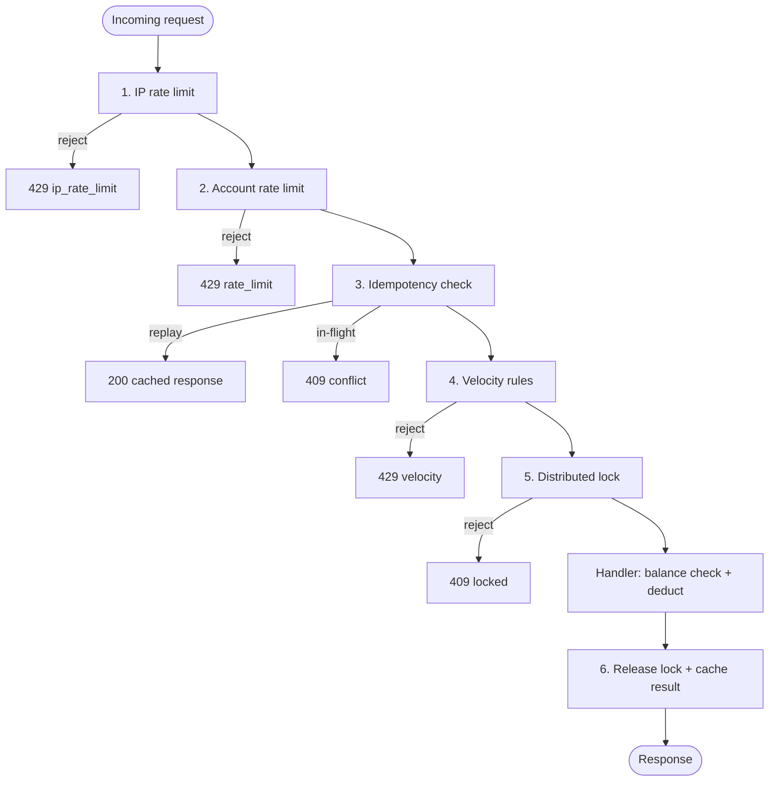

# Floodguard

[](https://github.com/duncanmwirigi/floodguard-rate-limiter/actions/workflows/test.yml)
[](https://goreportcard.com/report/github.com/duncanmwirigi/floodguard-rate-limiter)
[](LICENSE)
[](https://pkg.go.dev/github.com/duncanmwirigi/floodguard-rate-limiter)

**Floodguard** is an open-source Go library that protects HTTP and gRPC services from rapid or abusive traffic. It is built for high-stakes endpoints—withdrawals, bets, transfers, password resets—where duplicate or automated requests can drain accounts or degrade service for everyone else.

## Why Floodguard?

Financial and gaming APIs attract abuse that a plain rate limiter alone does not catch:

| Threat | Example | floodguard defense |
|--------|---------|-------------------|
| Request flooding | 500 bets/second from one account | **Rate limiting** (token bucket + sliding window) |
| Double-submit | User double-clicks "Withdraw" | **Idempotency keys** with cached responses |
| Race conditions | Parallel withdrawal requests | **Per-account distributed locks** |
| Anomaly / bot behavior | 30 withdrawals in 60 seconds | **Velocity rule engine** |

Each layer is swappable: use in-memory backends for development, or **Redis** for distributed production deployments.

## Install

```bash
go get github.com/duncanmwirigi/floodguard-rate-limiter
```

Import path: `github.com/duncanmwirigi/floodguard-rate-limiter` (subpackages: `/middleware`, `/ratelimit`, `/config`, etc.).

Requires Go 1.22+, Redis (example server + production), and for live scenarios: `curl` + `jq`.

## Table of contents

- [Install](#install)
- [Verify it works](#verify-it-works-copy-paste)
- [How to use this package](#how-to-use-this-package)
- [Project structure](#project-structure)
- [Quickstart (minimal)](#quickstart-minimal)
- [Companion packages](#companion-packages-gaps-14)
- [Architecture](#architecture)
- [Production setup (Redis)](#production-setup-redis)
- [Middleware reference](#middleware-reference)
- [Programmatic API (gRPC / custom)](#programmatic-api-grpc--custom)
- [Full stack (companion packages)](#full-stack-companion-packages)
- [Example server](#example-server)
- [Configuration](#configuration)
- [Testing](#testing)
- [Error handling](#error-handling)
- [HTTP status codes](#http-status-codes)
- [Troubleshooting](#troubleshooting)
- [Documentation map](#documentation-map)
- [Production readiness](#production-readiness)

## How to use this package

Floodguard is a **library**, not a standalone service. You embed it in your Go HTTP (or gRPC) server around endpoints that move money, place bets, or change sensitive state.

### Choose an integration path

| Path | When to use | Entry point |
|------|-------------|-------------|
| **HTTP middleware** | Standard REST API | `middleware.Handler(guard, opts)(yourHandler)` |
| **Programmatic** | gRPC, workers, non-HTTP | `guard.Protect()` + `guard.WithLock()` |
| **Full stack** | Withdrawals with device trust, step-up, CAPTCHA | Compose middleware layers — see [example/app/app.go](example/app/app.go) |
| **Example server** | Learn / demo / integration tests | `go run ./example` + `./scripts/run-scenarios.sh` |

### Step 1 — Create a `Guard`

**Local development** (single process, in-memory stores — no Redis):

```go
guard := floodguard.New(floodguard.Config{
    Velocity: velocity.Config{
        Rules: []velocity.Rule{
            velocity.RateOverWindow{N: 5, Window: time.Minute, Label: "withdrawals"},
        },
    },
})
```

**Production** (multi-instance — **Redis required**):

```go
client := redis.NewClient(&redis.Options{Addr: os.Getenv("REDIS_ADDR")})

guard := floodguard.New(floodguard.Config{
    IPRateLimiter: ipLimiter,      // ratelimit.NewRedisSlidingWindow(...)
    RateLimiter:   accountLimiter,
    Idempotency:   idempotency.Config{Store: idempotency.NewRedisStore(client, "myapp"), TTL: 24 * time.Hour},
    Lock:          lock.Config{Client: lock.NewRedis(client, "myapp"), TTL: 30 * time.Second},
    Velocity: velocity.Config{
        Store: velocity.NewRedisStore(client, "myapp"),
        Rules: []velocity.Rule{ /* see Velocity rules below */ },
    },
})
```

Or load limits from env via [`config.Load()`](config/config.go) and map fields into `floodguard.Config` (see [Configuration](#configuration)).

### Step 2 — Protect an HTTP route

Minimum for a withdrawal endpoint:

```go
mux.Handle("/withdraw", middleware.Handler(guard, middleware.Options{
    Action:                "withdraw",
    RequireLock:           true,  // serialize balance check + deduct
    RequireIdempotencyKey: true,  // reject missing Idempotency-Key
})(http.HandlerFunc(withdrawHandler)))
```

**Different limits per route** — create separate `middleware.Handler` instances:

```go
mux.Handle("/withdraw", middleware.Handler(guard, middleware.Options{
    Action: "withdraw", RequireLock: true, RequireIdempotencyKey: true,
})(withdrawHandler))

mux.Handle("/bet", middleware.Handler(guard, middleware.Options{
    Action: "bet", RequireLock: true,
})(betHandler))
```

Tune velocity per action by setting `Options.Action` (velocity key becomes `accountID:action`).

### Step 3 — What your API clients must send

For mutating endpoints protected by Floodguard:

| Header | Required? | Purpose |
|--------|-----------|---------|
| `X-Account-ID` | Yes (or custom `KeyFunc`) | Account / wallet identity |
| `Idempotency-Key` | Recommended (`RequireIdempotencyKey: true`) | Safe retries; duplicate keys return cached response |
| `X-Device-ID` | If using `devicetrust` / `stepup` | Device fingerprint (from your frontend cookie/localStorage) |
| `User-Agent`, `Accept-Language` | If using device fingerprinting | Hashed into device identity |

After a `403` step-up response, client retries with `X-Step-Up-Token` from the JSON body. After a CAPTCHA challenge, retry with `X-Challenge-Token` + `X-Captcha-Response`.

### Step 4 — Velocity rules

Built-in rules in `velocity/`:

```go
velocity.RateOverWindow{N: 3, Window: time.Minute, Label: "withdrawal attempts"}
velocity.MinInterval{Min: 200 * time.Millisecond, Label: "withdrawal"}
```

Implement `velocity.Rule` for custom patterns (bet size anomalies, geo signals, etc.).

**Flag vs block:** default `BlockOnVelocity: true` returns `429`. Set `BlockOnVelocity: false` and use `OnVelocityFlag` to feed step-up auth instead of blocking (see [example/app/app.go](example/app/app.go)).

### Step 5 — Optional companion packages

| Need | Package | Quick usage |
|------|---------|-------------|
| Stolen-credential detection | `devicetrust` | `FingerprintFromRequest(r, deviceID)` + `IsKnownDevice` |
| OTP/2FA on risky actions | `stepup` | `stepup.Middleware(mgr, opts)(handler)` |
| Alert owner on new device | `notify` | `notifier.AfterSensitiveAction(...)` after successful withdraw |
| Tamper-evident audit log | `ledger` | `ledger.RecordTransaction(...)` for every balance write |
| Platform-wide bot spike | `anomaly` | `detector.DetectSpike(...)` → alert, not block |
| CAPTCHA on new accounts | `challenge` | `challenge.Middleware(mgr, opts)(handler)` |

Recommended middleware order (outer → inner):

```
floodguard → stepup → challenge → your handler
```

See the wired example in [example/app/app.go](example/app/app.go).

## Verify it works (copy-paste)

**Step 1 — unit tests** (no Redis required for most packages):

```bash
cd floodguard
go test ./...
```

**Step 2 — live integration scenarios** (two terminals):

```bash
# Terminal 1: start Redis + example server
redis-server                          # if not already running
cp .env.example .env
set -a && source .env && set +a
go run ./example
```

```bash
# Terminal 2: run all 12 scenarios (expect 12 passed, 0 failed)
./scripts/run-scenarios.sh
```

Or use Make:

```bash
make test              # unit tests
make run               # start example server (Terminal 1)
make test-scenarios    # run ./scripts/run-scenarios.sh (Terminal 2)
make verify            # unit tests + reminder to run live scenarios
```

**Step 3 — manual withdraw** (trust device first, then withdraw):

```bash
# Trust this device for acct-1001
curl -s -X POST http://localhost:8080/demo/trust-device \
  -H "X-Account-ID: acct-1001" \
  -H "X-Device-ID: device-trusted-1001" \
  -H "User-Agent: FloodguardTest/1.0" \
  -H "Accept-Language: en-US"

# Withdraw KES 10.00 (1000 cents)
curl -s -X POST http://localhost:8080/withdraw \
  -H "X-Account-ID: acct-1001" \
  -H "Idempotency-Key: wd-manual-001" \
  -H "X-Device-ID: device-trusted-1001" \
  -H "User-Agent: FloodguardTest/1.0" \
  -H "Accept-Language: en-US" \
  -H "Content-Type: application/json" \
  -d '{"amount_cents":1000}'

# Check balance
curl -s http://localhost:8080/demo/balance -H "X-Account-ID: acct-1001"
```

## Project structure

```
floodguard/
├── config/                  # Environment variable loader (.env.example)
├── ratelimit/               # Token bucket + Redis sliding window
├── idempotency/             # Atomic idempotency keys
├── lock/                    # Distributed locks
├── velocity/                # Behavioral rule engine
├── middleware/              # HTTP protection stack
├── devicetrust/             # Device fingerprinting
├── stepup/                  # Risk-based OTP/2FA
├── notify/                  # Async sensitive-action alerts
├── ledger/                  # Hash-chained audit log
├── anomaly/                 # Platform-wide spike detection
├── challenge/               # Conditional CAPTCHA
├── example/
│   ├── main.go              # Runnable demo server
│   ├── app/                 # Server wiring + integration tests
│   ├── wallet/              # KES cents + property tests
│   └── testdata/            # Demo accounts + scenario catalog
├── scripts/
│   └── run-scenarios.sh     # curl integration runner (12 scenarios)
├── Makefile                 # make test | run | test-scenarios
├── .env.example             # Configuration template
└── PRODUCTION_READINESS.md  # Pre-launch audit checklist
```

## Quickstart (minimal)

Local dev with in-memory stores — no Redis:

```go
package main

import (
	"log"
	"net/http"
	"time"

	"github.com/duncanmwirigi/floodguard-rate-limiter"
	"github.com/duncanmwirigi/floodguard-rate-limiter/middleware"
	"github.com/duncanmwirigi/floodguard-rate-limiter/ratelimit"
	"github.com/duncanmwirigi/floodguard-rate-limiter/velocity"
	"golang.org/x/time/rate"
)

func main() {
	g := floodguard.New(floodguard.Config{
		IPRateLimiter: ratelimit.NewTokenBucket(ratelimit.TokenBucketConfig{
			Rate:  rate.Limit(50),
			Burst: 100,
		}),
		RateLimiter: ratelimit.NewTokenBucket(ratelimit.TokenBucketConfig{
			Rate:  rate.Limit(5),
			Burst: 10,
		}),
		Velocity: velocity.Config{
			Rules: []velocity.Rule{
				velocity.RateOverWindow{N: 20, Window: time.Minute, Label: "withdrawals"},
			},
		},
	})

	mux := http.NewServeMux()
	mux.Handle("/withdraw", middleware.Handler(g, middleware.Options{
		Action:                "withdraw",
		RequireLock:           true,
		RequireIdempotencyKey: true,
	})(http.HandlerFunc(withdrawHandler)))

	log.Fatal(http.ListenAndServe(":8080", mux))
}

func withdrawHandler(w http.ResponseWriter, r *http.Request) {
	w.Header().Set("Content-Type", "application/json")
	_, _ = w.Write([]byte(`{"status":"completed"}`))
}
```

Account identity defaults to **`X-Account-ID`** (falls back to client IP). Idempotency defaults to **`Idempotency-Key`** header. Override via `middleware.Options.KeyFunc`, `IdempotencyKeyFunc`, etc.

## Companion packages (Gaps 1–4)

Floodguard is the concurrency/abuse layer. These sibling packages close adjacent gaps:

| Package | Gap | Purpose |
|---------|-----|---------|
| [`devicetrust/`](devicetrust/) | Stolen credentials | Device fingerprinting + known-device detection |
| [`stepup/`](stepup/) | Stolen credentials | Risk-based OTP/2FA middleware (composes with velocity flags) |
| [`notify/`](notify/) | Stolen credentials | Fire-and-forget alerts on sensitive actions from new devices |
| [`ledger/`](ledger/) | Insider DB access | Append-only hash-chained audit log + tamper detection |
| [`anomaly/`](anomaly/) | Distributed botnet | Platform-wide spike detection (alert, not block) |
| [`challenge/`](challenge/) | Distributed botnet | Conditional CAPTCHA middleware (stub verifier for hCaptcha/Turnstile) |
| [`example/wallet/`](example/wallet/) | Business logic bugs | KES cents + property/regression tests |

**Recommended build order:** floodguard → wallet property tests → devicetrust + stepup → ledger → anomaly + challenge.

See [PRODUCTION_READINESS.md](PRODUCTION_READINESS.md) and [example/wallet/AUDIT.md](example/wallet/AUDIT.md).

## Architecture

A request passes through **six layers** before reaching your handler (when all options enabled):



| Package | Role |
|---------|------|
| [`floodguard`](floodguard.go) | `Guard` wires all subsystems; call `Protect` or use middleware |
| [`ratelimit/`](ratelimit/) | Per-key token bucket (memory) or sliding window (Redis) |
| [`idempotency/`](idempotency/) | Atomic claim + response cache by idempotency key |
| [`velocity/`](velocity/) | Composable rule engine for abuse patterns |
| [`lock/`](lock/) | Distributed lock per account/resource |
| [`middleware/`](middleware/) | HTTP middleware chaining all layers |
| [`config/`](config/) | Environment-based configuration loader (`.env.example`) |
| [`example/`](example/) | Runnable `POST /withdraw` demo with Redis |

Storage backends implement small interfaces (`Limiter`, `idempotency.Store`, `lock.Client`, `velocity.Store`) so you can swap in-memory and Redis without changing handler code.

## Production setup (Redis)

Use Redis for **every** shared store when running more than one app instance:

```go
import (
	"time"

	"github.com/duncanmwirigi/floodguard-rate-limiter"
	"github.com/duncanmwirigi/floodguard-rate-limiter/idempotency"
	"github.com/duncanmwirigi/floodguard-rate-limiter/lock"
	"github.com/duncanmwirigi/floodguard-rate-limiter/ratelimit"
	"github.com/duncanmwirigi/floodguard-rate-limiter/velocity"
	"github.com/redis/go-redis/v9"
)

client := redis.NewClient(&redis.Options{Addr: "localhost:6379"})

ipRateLimiter, _ := ratelimit.NewRedisSlidingWindow(client, "myapp:ip", ratelimit.SlidingWindowConfig{
	Limit: 100, Window: time.Minute,
})
accountRateLimiter, _ := ratelimit.NewRedisSlidingWindow(client, "myapp:acct", ratelimit.SlidingWindowConfig{
	Limit: 10, Window: time.Minute,
})

guard := floodguard.New(floodguard.Config{
	IPRateLimiter: ipRateLimiter,
	RateLimiter:   accountRateLimiter,
	Idempotency:   idempotency.Config{Store: idempotency.NewRedisStore(client, "myapp"), TTL: 24 * time.Hour},
	Lock:          lock.Config{Client: lock.NewRedis(client, "myapp"), TTL: 30 * time.Second},
	Velocity: velocity.Config{
		Store: velocity.NewRedisStore(client, "myapp"),
		Rules: []velocity.Rule{
			velocity.RateOverWindow{N: 5, Window: time.Minute, Label: "withdrawals"},
			velocity.MinInterval{Min: 300 * time.Millisecond, Label: "bet"},
		},
	},
})
```

Copy `.env.example` → `.env` for the example server, or map [`config.Load()`](config/config.go) into your own bootstrap.

## Middleware reference

`middleware.Handler(guard, middleware.Options{...})` accepts:

| Option | Default | Description |
|--------|---------|-------------|
| `Action` | `""` | Velocity label (`withdraw`, `bet`, …) |
| `KeyFunc` | `X-Account-ID` → IP fallback | Account / wallet key |
| `IPKeyFunc` | Client IP from request | Layer-1 rate limit key |
| `LockKeyFunc` | Same as `KeyFunc` | Distributed lock key |
| `IdempotencyKeyFunc` | `Idempotency-Key` header | Idempotency key source |
| `RequireLock` | `false` | Acquire lock before handler (use `true` for balance ops) |
| `RequireIdempotencyKey` | `false` | Reject if idempotency header missing |
| `FailClosed` | `true` | Return `503` when Redis/store unreachable |
| `BlockOnVelocity` | `true` | Block on velocity; `false` = flag via `OnVelocityFlag` |
| `OnVelocityFlag` | — | Callback when velocity fires and `BlockOnVelocity: false` |
| `Audit` | — | Structured event hook (`AuditEvent`) |
| `Logger` | — | Human-readable layer traces |

## Programmatic API (gRPC / custom)

For non-HTTP handlers, call `Guard` methods directly:

```go
ctx := r.Context()
result, err := guard.Protect(ctx, floodguard.Request{
    Key:            accountID,
    IPKey:          clientIP,
    IdempotencyKey: idemKey,
    Action:         "withdraw",
})
if err != nil {
    return status.Errorf(codes.Unavailable, "protection layer error: %v", err)
}
if !result.Allowed {
    switch result.Reason {
    case floodguard.RejectCached:
        return cachedResponse(result.CachedResponse)
    case floodguard.RejectRateLimit:
        return status.Error(codes.ResourceExhausted, "rate limit")
    // ...
    }
}

err = guard.WithLock(ctx, accountID, func(ctx context.Context) error {
    // balance check + deduct inside lock
    return nil
})
if err != nil {
    return err
}

_ = guard.CompleteIdempotency(ctx, idemKey, responseBytes)
```

`TryLock` is non-blocking — concurrent callers get an error and should retry (HTTP middleware maps this to `409 Conflict`).

## Full stack (companion packages)

The [example server](example/app/app.go) wires the complete stack for a KES withdrawal API:

1. **Floodguard** — rate limit, idempotency, velocity, lock  
2. **Step-up** — `403` + token when device unknown or velocity flagged  
3. **Challenge** — CAPTCHA for new accounts / platform spikes  
4. **Device trust** — fingerprint + trusted device store  
5. **Notify** — async alert on sensitive action from new device  
6. **Wallet + ledger** — `int64` KES cents + hash-chained audit log  

Run it: `go run ./example` (Redis required). Test it: `./scripts/run-scenarios.sh`.

## Example server

Copy [`.env.example`](.env.example) and load it before starting. See **[Verify it works](#verify-it-works-copy-paste)** for the full flow.

**Routes:**

| Method | Path | Purpose |
|--------|------|---------|
| `GET` | `/health` | Liveness check |
| `POST` | `/withdraw` | Protected withdrawal (requires headers below) |
| `POST` | `/demo/trust-device` | Mark device trusted (demo/tests only) |
| `GET` | `/demo/balance` | Read demo account balance |

**Required headers for `/withdraw`:**

| Header | Example | Purpose |
|--------|---------|---------|
| `X-Account-ID` | `acct-1001` | Account identity |
| `Idempotency-Key` | `wd-001` | Duplicate-submit protection |
| `X-Device-ID` | `device-trusted-1001` | Device fingerprint input |
| `User-Agent` | `FloodguardTest/1.0` | Fingerprint input |
| `Accept-Language` | `en-US` | Fingerprint input |

Optional: `X-Step-Up-Token` (after 403 step-up), `X-Challenge-Token` + `X-Captcha-Response: valid-captcha` (after 403 CAPTCHA).

```bash
cp .env.example .env
set -a && source .env && set +a
go run ./example
```

Server logs trace each layer: rate limit → idempotency → velocity → lock → step-up → challenge → handler.

## Configuration

All tunable settings load from environment variables via [`config.Load()`](config/config.go). Defaults match `.env.example`.

| Variable | Default | Description |
|----------|---------|-------------|
| `LISTEN_ADDR` | `:8080` | HTTP listen address |
| `REDIS_ADDR` | `localhost:6379` | Redis connection |
| `REDIS_KEY_PREFIX` | `floodguard` | Namespace for all Redis keys |
| `REDIS_PING_TIMEOUT` | `3s` | Startup Redis health check timeout |
| `IP_RATE_LIMIT` | `30` | Max requests per IP per window |
| `IP_RATE_WINDOW` | `1m` | IP rate limit window |
| `ACCOUNT_RATE_LIMIT` | `10` | Max requests per account per window |
| `ACCOUNT_RATE_WINDOW` | `1m` | Account rate limit window |
| `IDEMPOTENCY_TTL` | `24h` | Cached idempotent response lifetime |
| `VELOCITY_WITHDRAW_MAX` | `3` | Max withdrawal attempts per velocity window |
| `VELOCITY_WINDOW` | `1m` | Velocity rule window |
| `VELOCITY_MIN_INTERVAL` | `200ms` | Minimum time between withdrawals |
| `LOCK_TTL` | `30s` | Distributed lock TTL |
| `BLOCK_ON_VELOCITY` | `false` | Block on velocity (false = flag-only for step-up) |
| `REQUIRE_IDEMPOTENCY_KEY` | `true` | Reject requests without Idempotency-Key |
| `REQUIRE_LOCK` | `true` | Acquire distributed lock before handler |
| `ANOMALY_SPIKE_MULTIPLIER` | `5` | Platform spike threshold (current vs baseline) |
| `ANOMALY_LOOKBACK_MINUTES` | `60` | Baseline lookback for spike detection |
| `CHALLENGE_NEW_ACCOUNT_MAX_AGE` | `24h` | Accounts younger than this require CAPTCHA |
| `STEPUP_TOKEN_TTL` | `10m` | Step-up challenge token lifetime |
| `DEVICE_TRUST_STORE` | `memory` | `memory` or `redis` |
| `NOTIFY_ENABLED` | `true` | Send alerts on sensitive actions from new devices |
| `DEMO_ACCOUNT_BALANCES` | `acct-1001=50000,...` | Demo seed balances (KES cents) |

In your own app, import `github.com/duncanmwirigi/floodguard-rate-limiter/config` and map the struct fields into each package's config at startup — no need to fork the loader.

## Testing

### Unit and property tests

```bash
go test ./...              # all packages
go test -race ./...        # with race detector
go test ./example/wallet/  # property-based balance invariants (gopter)
go test ./example/app/     # HTTP scenario tests (miniredis, no live server)
```

### Test data

Demo accounts and headers are defined in [`example/testdata/accounts.json`](example/testdata/accounts.json).

**Currency:** amounts use **KES minor units (cents)** — `50000` = KES 500.00, `1000` = KES 10.00.

| Account | Balance | Notes |
|---------|---------|-------|
| `acct-1001` | KES 500.00 (50000 cents) | Primary demo account, mature |
| `acct-1002` | KES 100.00 (10000 cents) | Secondary account |
| `acct-new` | KES 0 | Created on first request — triggers CAPTCHA |
| `acct-empty` | KES 1.00 (100 cents) | Insufficient-funds tests |

Trust a device before withdrawing from a mature account:

```bash
curl -s -X POST http://localhost:8080/demo/trust-device \
  -H "X-Account-ID: acct-1001" \
  -H "X-Device-ID: device-trusted-1001" \
  -H "User-Agent: FloodguardTest/1.0" \
  -H "Accept-Language: en-US"
```

Stub CAPTCHA token for tests: `valid-captcha` (see `challenge.StubVerifier`).

### Integration scenarios (live server)

[`example/testdata/scenarios.json`](example/testdata/scenarios.json) catalogs each scenario. [`scripts/run-scenarios.sh`](scripts/run-scenarios.sh) runs them against a live server (**requires `curl`, `jq`, Redis, and the example server running**):

```bash
# Terminal 1
redis-server
cp .env.example .env && set -a && source .env && set +a
go run ./example

# Terminal 2
./scripts/run-scenarios.sh
# Expected: ==> Results: 12 passed, 0 failed
```

| # | Scenario | Expected |
|---|----------|----------|
| 01 | Health check | `200 OK` |
| 02 | Trust device | `200` + device marked trusted |
| 03 | Withdraw (trusted device) | `200` + balance deducted |
| 04 | Idempotent replay | `200` + `X-Idempotent-Replay: true` |
| 05 | Insufficient funds | `402 Payment Required` |
| 06 | Invalid amount (negative) | `400 Bad Request` |
| 07 | Missing Idempotency-Key | `400 Bad Request` |
| 08 | Step-up (unknown device) | `403` + `challenge_token` |
| 08b | Step-up with token | `200` after `X-Step-Up-Token` |
| 09 | CAPTCHA (new account) | `403` + `X-Challenge-Required` |
| 09b | CAPTCHA solved | `402` (passed challenge; KES 0 balance) |
| 10 | Balance check | `200` + `balance_cents` |

The script pauses 300ms between withdrawals to avoid velocity `MinInterval` collisions. Override server URL: `BASE_URL=http://localhost:9090 ./scripts/run-scenarios.sh`

## Error handling

Sentinel errors support `errors.Is` / `errors.As` throughout:

```go
result, err := g.Protect(ctx, req)
if floodguard.IsDuplicateInFlight(err) {
	// 409 Conflict — same idempotency key already in flight
}
if errors.Is(err, floodguard.ErrKeyRequired) {
	// missing account key
}
if floodguard.IsRejected(err, floodguard.RejectRateLimit) {
	// programmatic rejection
}
```

Subpackages export their own sentinels (`ratelimit.ErrKeyRequired`, `lock.ErrNotAcquired`, `idempotency.ErrInFlight`, etc.). Operational failures are wrapped with `%w`.

## HTTP status codes

| Condition | Status |
|-----------|--------|
| IP rate limit exceeded | `429 Too Many Requests` (`ip_rate_limit`) |
| Account rate limit exceeded | `429 Too Many Requests` (`rate_limit`) |
| Velocity threshold exceeded | `429 Too Many Requests` |
| Redis / store unreachable | `503 Service Unavailable` (when `FailClosed: true`) |
| Resource locked (concurrent request) | `409 Conflict` |
| Duplicate in-flight idempotency key | `409 Conflict` |
| Idempotent replay | `200 OK` + `X-Idempotent-Replay: true` |
| Step-up required (unknown device) | `403 Forbidden` + `challenge_token` |
| CAPTCHA required (new account) | `403 Forbidden` + `X-Challenge-Required` |
| Insufficient funds (example handler) | `402 Payment Required` |

## Troubleshooting

| Symptom | Likely cause | Fix |
|---------|--------------|-----|
| `503` on every request | Redis down or wrong `REDIS_ADDR` | Start Redis; check env; `FailClosed` defaults to deny |
| `409 Conflict` on concurrent withdraws | Expected — `TryLock` is non-blocking | Client retries with backoff; only one holder at a time |
| `403` + `challenge_token` | Unknown device or velocity flagged | Complete step-up; trust device via your auth flow |
| `403` + `X-Challenge-Required` | New account or platform spike | Solve CAPTCHA; retry with tokens |
| `400` missing idempotency | `RequireIdempotencyKey: true` | Client sends `Idempotency-Key` on every mutating request |
| `bind: address already in use` | Port 8080 taken | `kill $(lsof -t -i:8080)` or `LISTEN_ADDR=:8081 go run ./example` |
| Integration script failures | Velocity `MinInterval` between rapid curls | Script pauses 300ms; use isolated accounts per scenario |
| Works locally, fails in prod | In-memory stores don't sync across pods | Switch all backends to Redis |

## Documentation map

| Document | Purpose |
|----------|---------|
| [README.md](README.md) | Usage guide (this file) |
| [PRODUCTION_READINESS.md](PRODUCTION_READINESS.md) | Pre-launch audit checklist |
| [example/wallet/AUDIT.md](example/wallet/AUDIT.md) | Business-logic regression findings |
| [CONTRIBUTING.md](CONTRIBUTING.md) | Dev setup, CI, PR guidelines |
| [CHANGELOG.md](CHANGELOG.md) | Release history |
| [.env.example](.env.example) | All environment variables |
| [example/testdata/](example/testdata/) | Demo accounts + scenario catalog |

## Production readiness

Before handling real funds, walk through [PRODUCTION_READINESS.md](PRODUCTION_READINESS.md) — an audit checklist mapping each control to floodguard capabilities and platform responsibilities.

## Contributing

See [CONTRIBUTING.md](CONTRIBUTING.md). CI runs `go vet`, `go test -race`, and `golangci-lint` on every push and pull request.

## Changelog

See [CHANGELOG.md](CHANGELOG.md).

## Author

**Duncan Mwirigi**  
GitHub: [github.com/duncanmwirigi](https://github.com/duncanmwirigi)  
X: https://x.com/AIStiqDan  
Website: https://bytecityinc.com

## License

MIT — see [LICENSE](LICENSE).
